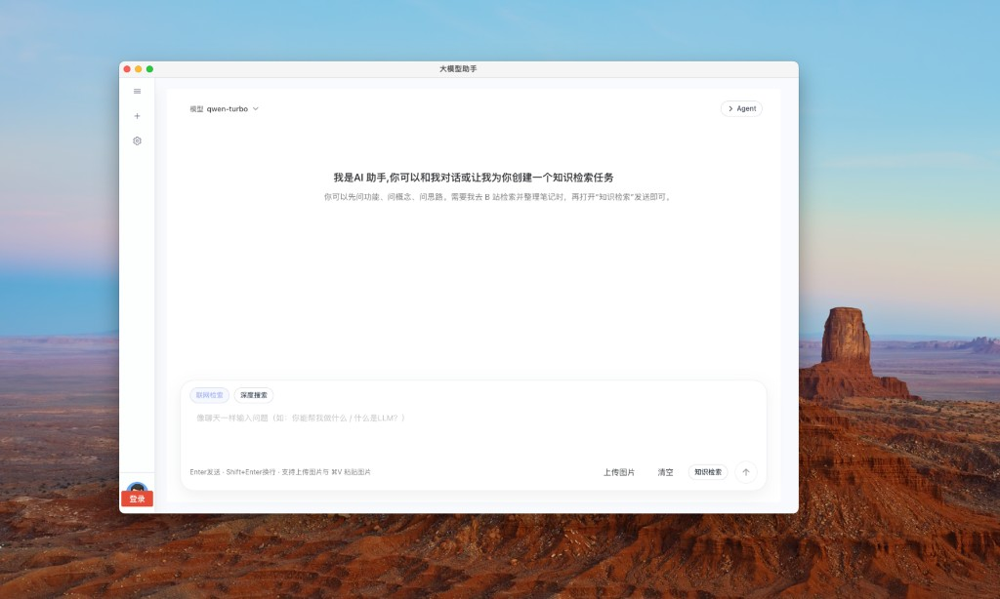

# Electron + Vue3 大模型助手桌面端

这是一个基于 `Electron + Vue 3 + TypeScript + Vite + SQLite` 的桌面应用项目，定位为「可离线运行、可本地持久化」的大模型助手客户端。  
项目内置登录/主窗口切换、主题与布局状态持久化、模板管理、聊天会话存储等能力，可直接作为 AI 桌面工具或后台管理桌面端的基础工程。

## 1. 项目简介

### 1.1 核心特性

- 双进程架构：主进程负责窗口与系统能力，渲染进程负责界面与交互逻辑。
- 双窗口流转：登录窗口与主窗口分离，通过 IPC 控制打开/关闭。
- 前端技术栈完整：`Vue 3 + Pinia + Vue Router + Naive UI + Tailwind CSS`。
- 本地数据库能力：内置 `better-sqlite3 + Drizzle ORM`，支持配置、模板、聊天记录落盘。
- 可选无数据库模式：通过环境变量关闭 SQLite，用于兼容部分环境快速启动。
- 可直接打包发布：集成 `electron-builder`，默认产物为 macOS `dmg` / Windows `nsis`。

### 1.2 技术栈

- Electron `30`
- Vue `3` + TypeScript + Vite `7`
- Pinia + `pinia-plugin-persistedstate`
- Naive UI + Tailwind CSS `v4`
- Drizzle ORM + better-sqlite3
- electron-builder（安装包构建）

## 2. 目录结构说明

```text
electron-vue3-ai
├── electron/                 # 主进程与数据库层
│   ├── main.ts               # Electron 入口、窗口生命周期、IPC 注册
│   ├── preload.ts            # contextBridge 暴露 window.electronAPI
│   ├── db.ts                 # SQLite 初始化、自动建表、默认数据初始化
│   ├── schema.ts             # Drizzle 表结构定义
│   └── repository.ts         # 数据访问封装（CRUD 与会话相关逻辑）
├── src/                      # 渲染进程（Vue 应用）
│   ├── router/               # 前端路由
│   ├── stores/               # Pinia 状态
│   ├── layouts/              # 布局组件
│   ├── views/                # 页面视图
│   └── config/               # 菜单/主题等配置
├── drizzle.config.ts         # Drizzle CLI 配置
├── vite.config.ts            # Vite 配置
└── package.json              # 脚本、依赖、打包配置
```

## 3. 安装与运行

### 3.1 环境要求

- Node.js `20+`（建议使用 LTS）
- npm `9+`
- macOS / Windows（Linux 可自行适配）

> 说明：项目使用了 `better-sqlite3` 原生模块，首次安装会进行本地编译或下载预编译二进制。

### 3.2 安装依赖

```bash
npm install
```

如果出现 `better-sqlite3` ABI 或平台不匹配错误，执行：

```bash
npm run rebuild
```

#### 验证 Electron 是否安装成功

`npm install` 完成后，建议在项目根目录执行：

```bash
npx electron -v
```

若输出版本号，且与 `package.json` 中 `electron` 的主版本一致（例如 `v30.x.x`），说明 Electron 二进制已正确下载。  
若多次执行 `npm install` 仍失败（常见于拉取 Electron 时出现网络中断、`socket hang up` 等），可开启**科学上网**后重试安装，直到上述命令能稳定输出正确版本。

若 `npx electron -v` 提示要安装与本项目无关的其它大版本 **Electron**，请勿确认该安装，可改用下面命令（强制使用当前项目 `node_modules` 内的 Electron）：

```bash
npm exec electron -- -v
```

### 3.3 申请阿里百炼 API Key 并配置 `.env`

首次下载项目后，建议先完成阿里百炼（DashScope）认证配置，再启动应用。

#### 第一步：申请 API Key

1. 打开阿里云百炼控制台，创建并获取 API Key。  
   控制台入口：[阿里云百炼 DashScope](https://bailian.console.aliyun.com/)
2. 记录你创建 Key 时选择的地域（常见为北京或新加坡），后续 `.env` 需要保持一致。

#### 第二步：将 `.env.example` 改为 `.env`

在项目根目录执行：

```bash
cp .env.example .env
```

如果你更习惯“改名”而不是复制，也可以执行：

```bash
mv .env.example .env
```

> 建议优先用 `cp` 保留模板文件，方便团队协作和后续对照；项目已在 `.gitignore` 忽略 `.env`。

#### 第三步：填写关键配置

在 `.env` 中至少配置以下变量：

```env
VITE_APP_ALI_QIANWEN_API_KEY=你的阿里百炼APIKey
VITE_ALI_QWEN_API_MODEL=qwen-turbo
```

可选地域配置（当 Key 非北京地域时必须配置）：

```env
VITE_DASHSCOPE_REGION=singapore
VITE_DASHSCOPE_BASE_URL=https://dashscope-intl.aliyuncs.com
```

配置建议：

- 未开通高阶模型时，优先使用 `qwen-turbo`，稳定且成本更低。
- 若接口报 `404`，优先排查 Key 地域与 `VITE_DASHSCOPE_REGION` 是否一致。
- 若接口报认证错误，优先检查 `VITE_APP_ALI_QIANWEN_API_KEY` 是否正确、是否有前后空格。

### 3.4 本地开发运行

```bash
npm run dev
```

该命令会并行启动：

- `vite`（前端开发服务，端口 `5174`）
- Electron 主进程（等待 Vite 就绪后自动启动）

正常情况下，除 Vite 可能会自动打开本地预览页外，**应出现 Electron 桌面应用窗口（本项目的真正运行形态）**。若只有浏览器页面、始终看不到桌面窗口，通常是 Electron 未装好或主进程启动失败，请先完成上文「验证 Electron 是否安装成功」中的版本检查，并留意终端中的报错信息。

`npm run dev` 成功后的界面示例（桌面端窗口标题为「大模型助手」）：



#### 可选：无数据库开发模式

```bash
npm run dev:nodb
```

此模式会注入 `ELECTRON_DISABLE_SQLITE=1`，主进程不会加载 SQLite，所有数据库相关 IPC 会返回降级结果（例如空列表、`null`、`0`）。

#### 可选：自动打开 DevTools

- macOS/Linux:

```bash
OPEN_DEVTOOLS=1 npm run dev
```

- Windows PowerShell:

```powershell
$env:OPEN_DEVTOOLS=1; npm run dev
```

## 4. 构建与打包发布

### 4.1 一键构建（推荐）

```bash
npm run build
```

执行顺序为：

1. `vue-tsc -b`：前端类型检查
2. `vite build`：构建渲染进程
3. `tsc -p electron/tsconfig.json`：构建主进程
4. `electron-builder`：打包安装包

### 4.2 构建产物位置

- `dist/`：渲染进程产物
- `dist-electron/`：主进程产物
- `release/`：安装包产物（最终发布文件）

### 4.3 按平台打包

默认配置在 `package.json > build`：

- macOS: `dmg`
- Windows: `nsis`

如果只想运行打包器（前提是 `dist` 与 `dist-electron` 已是最新）：

```bash
npm run build:electron
```

按平台指定示例：

```bash
npm run build:electron -- --mac dmg
npm run build:electron -- --win nsis
```

### 4.4 无数据库构建

```bash
npm run build:nodb
```

适用于希望临时跳过 SQLite 初始化与加载的场景（例如某些 CI 环境或原生模块受限环境）。

## 5. SQLite 使用方式（重点）

本项目的本地数据库使用 `better-sqlite3`（同步驱动）+ `Drizzle ORM`，数据库由主进程托管，渲染进程通过 `preload + IPC` 间接访问。

### 5.1 数据库文件位置

- 路径：`app.getPath('userData')/app.db`
- 含义：每个安装实例在系统用户目录下拥有独立数据库，不与项目源码目录耦合。

### 5.2 首次启动自动初始化

应用启动时主进程会执行数据库初始化逻辑，自动完成：

1. 创建表（不存在时）：
   - `system_setting`
   - `report_template`
   - `report_result_template`
   - `chat_session`
   - `chat_message`
2. 创建索引（会话消息查询相关）。
3. 写入默认系统配置（当 `status=1` 记录不存在时）。
4. 自动创建目录：
   - `TemplateBaseUrl/`
   - `ReportSaveUrl/`

### 5.3 访问链路（推荐理解）

调用链如下：

1. 渲染进程调用 `window.electronAPI.db.xxx(...)`
2. `preload.ts` 使用 `ipcRenderer.invoke(...)` 发起请求
3. `main.ts` 中 `ipcMain.handle(...)` 接收并分发
4. `repository.ts` 调用 Drizzle 执行 SQL
5. `db.ts` 维护 SQLite 连接与初始化

这种模式可以避免在渲染进程直接暴露 Node 能力，安全边界更清晰。

### 5.4 常用数据库 API

#### 系统设置

- `db.insertSystemSetting(templateBaseUrl, reportSave)`
- `db.getSystemSetting()`
- `db.updateSystemSetting(id, data)`

#### 模板管理

- `db.insertTemplate(fileUrl)`
- `db.listTemplates()`
- `db.deleteTemplate(id)`

#### 会话与消息

- `db.upsertChatSession(payload)`
- `db.listChatSessions(limit?)`
- `db.deleteChatSession(sessionUuid)`
- `db.saveChatMessage(payload)`
- `db.listChatMessages(sessionUuid, limit?)`
- `db.replaceChatSessionMessages(payload)`

### 5.5 在渲染进程中的调用示例

```ts
// 查询数据库是否可用（用于兼容 nodb 模式）
const available = await window.electronAPI.db.isAvailable()
if (!available) {
  console.warn('SQLite 不可用，当前处于降级模式')
}

// 读取系统配置
const setting = await window.electronAPI.db.getSystemSetting()

// 保存一条用户消息
await window.electronAPI.db.saveChatMessage({
  sessionUuid: 'demo-session',
  role: 'user',
  content: '你好，帮我生成一份报告摘要',
  meta: { from: 'readme-demo' },
})
```

### 5.6 使用建议

- 所有 DB 调用统一走 `window.electronAPI`，不要在渲染层直接引入 Node/SQLite。
- 会话 `sessionUuid` 建议使用稳定唯一值（如 UUID），避免覆盖历史会话。
- 若需要扩展新表：
  1. 在 `electron/schema.ts` 定义结构
  2. 在 `electron/db.ts` 增加建表 SQL（当前运行时自动建表依赖这里）
  3. 在 `electron/repository.ts` 增加访问方法
  4. 在 `electron/main.ts` / `electron/preload.ts` 增加 IPC 通道

## 6. Drizzle 迁移命令

项目已配置 Drizzle CLI，可用于维护迁移文件：

```bash
npm run drizzle:generate
npm run drizzle:migrate
```

> 注意：当前项目运行时仍使用 `db.ts` 里的 `CREATE TABLE IF NOT EXISTS` 初始化策略。迁移命令更适合结构演进和版本化管理。

## 7. 常见问题

### 7.1 `better-sqlite3` 安装失败

- 执行 `npm run rebuild`
- 确认 Node 版本与 Electron 版本兼容
- 确认本机构建工具链可用（特别是 Windows）

### 7.2 开发时白屏 / 页面未加载

- 确认 `npm run dev` 后 Vite 实际监听在 `5174`
- 确认 `VITE_DEV_SERVER_URL` 被正确注入（脚本内已处理）
- 确认路由使用 Hash 模式并访问正确路径（如 `/#/login`）

### 7.3 为什么数据库 API 返回空数据

- 先检查是否运行了 `dev:nodb` 或设置了 `ELECTRON_DISABLE_SQLITE=1`
- 调用 `window.electronAPI.db.isAvailable()` 确认当前是否为数据库降级模式

## 8. License

MIT
